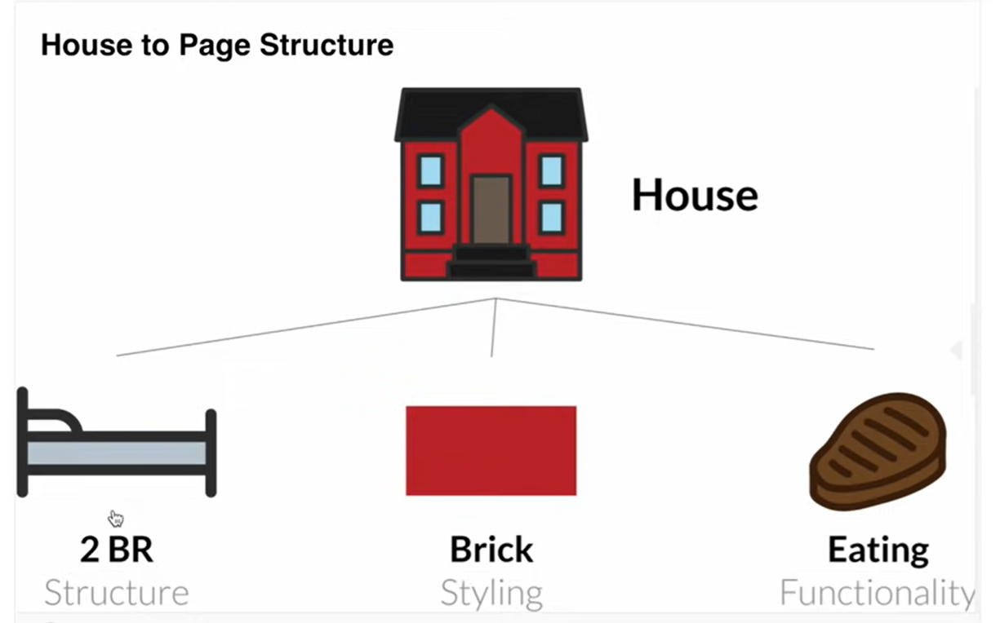

# web-development
Repositório destinado ao estudo de desenvolvimento web

# Estrutura de um website
- HTML: estrutura
- CSS: estilo
- JS: funcionalidade

# Elementos
- `h1:` título grande. Vai diminuindo de acordo com o aumento do "h", por exemplo, h1 > h2 > h3
- `body:` contém toda parte visível da página 
- `p:` parágrafo. Texto principal a ser lido
- `comentários:` mostra mensagens sem afetar o output do programa
- `main:`
- `img:` não tem uma closing tag. Contém o src="" que indica o caminho de onde o o code editor deve puxar a imagem. Ele também possui um alt="", que é um texto que aparece caso não se consiga mostrar a imagem. 
- `HTML atributes:` palavras especiais usadas dentro de uma opening tag de um elemento para controlar o comportamento do elemento. 
- `a (âncora):` qualquer coisa pode ser uma âncora para um link. Usa um href="" (link) e cria meio que um botão ou um link clicável como o nome que fica entre o opening e o closing tag do a. Dentro do a também existe o target que pode ser:
> _self: abre o link na mesma página

> _blank: abre o link em uma nova aba do navegador

> _parent: abre o link no frame pai do atual. Se não houver um pai, comporta-se como um "_self"

> _top: abre o link no contexto do topo da janela, removendo todos os frames. Se não houver frames, comporta-se como "_self"

- `ul (unsorted list):` meio que dá um tab pra iniciar uma lista com "li"
- `li (list):` cria os pontos * da lista de itens
- `ol (ordered list):` dá um tab pra lista mas numera cada item da lista com 1. 2. ...
- `strong: bold a palavra
- `em (enfatizar):` torna a plavra italico
- `small:` diminui um pouco o tamanho da fonte diretamente no html
- `form:` cria um form com algum atributo ao caminho para o backend. o parâmetro action="" chama o caminho, placeholder="" indeica o que tá escrito dentro da box
- `button:` cria um botão 
- `input:` se colocar qualquer tipo e o parâmetro "required" no fim, só vai ser possível submitar se o campo for preenchido. O atributo name="" serve para que, se dois inputs tiverem o mesmo nome, quando selecionar um, deselecionar o outro.

> type radio: selecionar

> type text: colocar texto

> type time: adicionar tempo 

> type checkbox: permite selecionar mais de um item. Para deixar tudo selecionado por default é só colocar o parâmetro "checked"

- `label:` faz com que quando eu clique no nome seja a mesma coisa de clicar no target
> for="": funciona como um link entre o label e o child que tá dentro do label. ele deve ser igual ao id do childs

- `br:` line break entre elementos
- `div (division):` usados pra qualquer coisa. São muito importantes pq são comumente usados para linkar com o CSS para estililzar uma sessão da sua página de um jeito particular.
> class: nomeia uma div para ser chamada pelo css

- `footer:` usado fora da main, apesar de não mudar nada na tela, ou seja, é muito mais pra identificação do que para efeito visual.

*A maioria dos elementos são containers que contém informação entre a opening tag e a closing tag. Exemplo: <>hello</>*

Outros elementos não contém necessariamente informação acompanhada. Como exemplo, pode-se citar <!doctype html>. Isso avisa ao servidor para ele esperar um documento HTML usando a versão mais atual.

Um fato sobre os atributos: a ordem não importa!

Dentro do head do html, é preciso ter a liguagem da página, os links para o css e o js e o resto vem qnd digita '!'

