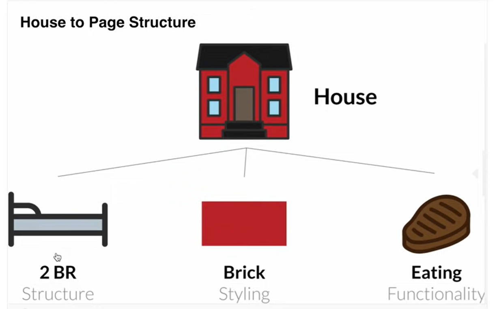
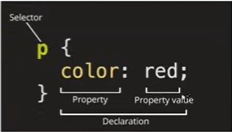
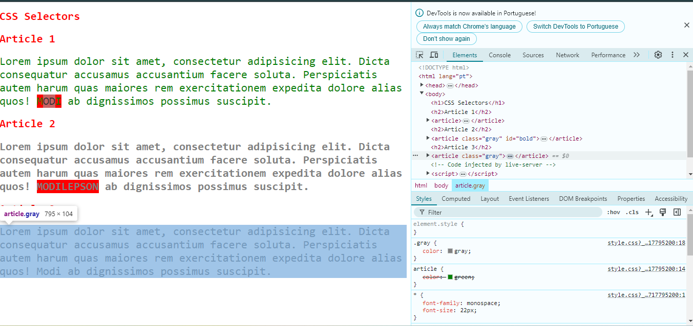
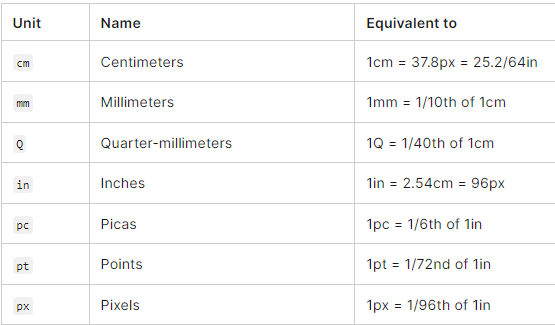
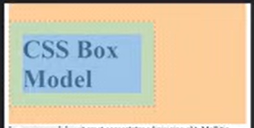

# web-development
Repositório destinado ao estudo de desenvolvimento web

# Estrutura de um website
- HTML: estrutura
- CSS: estilo
- JS: funcionalidade

# Elementos
- `h1:` título grande. Vai diminuindo de acordo com o aumento do "h", por exemplo, h1 > h2 > h3
- `body:` contém toda parte visível da página 
- `p:` parágrafo. Texto principal a ser lido
- `comentários:` mostra mensagens sem afetar o output do programa
- `main:`
- `img:` não tem uma closing tag. Contém o src="" que indica o caminho de onde o o code editor deve puxar a imagem. Ele também possui um alt="", que é um texto que aparece caso não se consiga mostrar a imagem. 
- `HTML atributes:` palavras especiais usadas dentro de uma opening tag de um elemento para controlar o comportamento do elemento. 
- `a (âncora):` qualquer coisa pode ser uma âncora para um link. Usa um href="" (link) e cria meio que um botão ou um link clicável como o nome que fica entre o opening e o closing tag do a. Dentro do a também existe o target que pode ser:
> _self: abre o link na mesma página

> _blank: abre o link em uma nova aba do navegador

> _parent: abre o link no frame pai do atual. Se não houver um pai, comporta-se como um "_self"

> _top: abre o link no contexto do topo da janela, removendo todos os frames. Se não houver frames, comporta-se como "_self"

- `ul (unsorted list):` meio que dá um tab pra iniciar uma lista com "li"
- `li (list):` cria os pontos * da lista de itens
- `ol (ordered list):` dá um tab pra lista mas numera cada item da lista com 1. 2. ...
- `strong: bold a palavra
- `em (enfatizar):` torna a plavra italico
- `small:` diminui um pouco o tamanho da fonte diretamente no html
- `form:` cria um form com algum atributo ao caminho para o backend. o parâmetro action="" chama o caminho, placeholder="" indeica o que tá escrito dentro da box
- `button:` cria um botão 
- `input:` se colocar qualquer tipo e o parâmetro "required" no fim, só vai ser possível submitar se o campo for preenchido. O atributo name="" serve para que, se dois inputs tiverem o mesmo nome, quando selecionar um, deselecionar o outro.

> type radio: selecionar

> type text: colocar texto

> type time: adicionar tempo 

> type checkbox: permite selecionar mais de um item. Para deixar tudo selecionado por default é só colocar o parâmetro "checked"

- `label:` faz com que quando eu clique no nome seja a mesma coisa de clicar no target
> for="": funciona como um link entre o label e o child que tá dentro do label. ele deve ser igual ao id do childs

- `br:` line break entre elementos
- `div (division):` usados pra qualquer coisa. São muito importantes pq são comumente usados para linkar com o CSS para estililzar uma sessão da sua página de um jeito particular.
> class: nomeia uma div para ser chamada pelo css

- `footer:` usado fora da main, apesar de não mudar nada na tela, ou seja, é muito mais pra identificação do que para efeito visual.

*A maioria dos elementos são containers que contém informação entre a opening tag e a closing tag. Exemplo: <>hello</>*

Outros elementos não contém necessariamente informação acompanhada. Como exemplo, pode-se citar <!doctype html>. Isso avisa ao servidor para ele esperar um documento HTML usando a versão mais atual.

Um fato sobre os atributos: a ordem não importa!

Dentro do head do html, é preciso ter a liguagem da página, os links para o css e o js e o resto vem qnd digita '!'

# CSS

Cascarding Style Sheets (CSS) é usado para estilar o código HTML de acordo com as divs e as características dadas a elas. É o CSS que deixa a aplicação bonita ou estilizada.

CSS pode ser aplicado internamente, inline ou externamente (preferível). Se for externamente, deve ser linkado no head do html. 

Quando uma declaração não acontece da forma que o CSS espera, seja por erro na nomenclatura da propriedade ou no valor, o CSS simplemente ignora e usa os valores deafult, ele não exibe um erro, o que pode tornar difícil a identificação de algo errado. É possível validar usando um site chamado ´css validation service´

> link rel="stylesheet" href="style.css": linka html e css

> style: cria um css dentro do html

> style como parâmetro do elemento (evitar)

- font-size
- font-familly
- font-weight
- color
- background-color
- text-transform
- border

> É possível colocar um "!important" depois do valor da propriedade, mas é preciso evitar pq isso indica má organização do código e faz com que a informação sobrescreva qualquer outra

## Selectors

Um selector é basicamente o tipo de marcador que é usado pra associar elementos do html com o estilo css. Ex: body, p, h1. Qualquer coisa pode ser alterada pelo selector

1. `Elementos` (tipoDoElemento)
2. `Classes:` qualquer elemento pode ter uma classe (meio que um nome específico pra ela, ou um id). Isso ajuda a quando eu quero, mesmo sabeno que são o mesmo tipo de elemnto, diferenciar duas coisas. (.nomeDaClasse)
3. `Id:` ainda mais específico que a classe. Serve pra quando uma mesma classe é atribuída a mais de um elemnto e euq euro editar somente um elemento. (#id). A melhor forma de fazer, no entanto, é focar no uso de classes.
4. `Universal (*):` ele pega todo mundo da página

Como classes são mais esfecíficas que elementos, elas sobrepõem o estilo dos elementos

É possível agrupar selectors que você quer que tenham o mesmoestilo utilizando a vírgula para separar. Exemplo: h1, h1 {}

Se não separar por vígula, ele vai produrar por algo que está dentro do primeiro selector. Exemplo: article span -> ele vai procurar todas as palavras que estão dentro do tipo span dentro de todos os tipos article. No entanto, é mais vantajoso utilizar uma classe para o span para que ele possa ser reutilizado em outros pontos do código

É possível inspecionar uma página para saber quais classes e qual estilo está sendo aplicado àquela classe:

> `Herança:` tipicamente, qualquer coisa relacionada a font e font-size é herdade, além de line, height, alignment. Ou seja, qualquer configuração que lide com font e tipografia. Qualquer coisa que não esteja ligado a isso, não é dado como herança.

> Specify Calulator: Ajuda a calcular a especificidade de um selector

## Colors

- `background-color (shortcut: background):` altera a cor do fundo da tela toda. É possível mudar as cores através da paleta oferecida pelo vscode clicando na janelinha de cor.
- `color:` muda a cor da fonte da página. Aqui, também é possível colocar uma cor pelo seu rbg colocando: `color: rbg(255,0,0)` ou pelo seu hexadecimal como `#f5f5f5` ou hsl como `hsl(0, 100%, 50%)`

> obs: ao escoher uma cor de background, é importante levar em cnosideração o contraste com a cor da letra, pra que fique visível

> coolors.co: color pallet picking tool. Também tem um contrast checker que vc coloca a cor de fundo e da fonte e ele dá uma nota pra saber o quão bom tá

## Unit and Sizes

- `pixel (px):` é a principal unidade absoluta que vai ser usada e é a que geralmente mais utilizada. O default é `16px`, 1rem (root element).

- `porcentagem (%):` por default, width do h1 é 100%. Ele represetna a porcentagem de algum valor default do parâmetro

- `ch:` define a quantidade de caracteres de um parágrafo ou bloco de texto -> é importante para definição de colunas, por exemplo

> OBS: a escolha de um absolute font-size tira a escolha do usuário de alterar nas configurações do chrome e alterar também a fonte, pois define que, independente de qualquer coisa, o tamanho da fonte vai ser x

***PRÁTICAS RECOMENDADAS***
- Tamanho de fonte: `em` ou `rem` -> em > rem
- larguras e alturas: `%` ou `vh`/ `vw`
- espaçamento (margin/ padding): `rem`
- layouts de grid: `fr`

## Box Model

- padding: determina um espaço dentro do border pra o texto não fica muito colado nas bordas
- border: largura da box que delimita o texto
- margin: espaço externo entre o border e os elementos vizinhos -> isso é o que deixa mais visualmente atrativo e bonito. Se setar left-right to `auto`, ele fica centralizado horizontalmente
- box-sizing: define como o cálculo da largura e altura de um elemtno deve ser feito, incluindo ou excluindo o padding e o border no cálculo dessas dimensões. O defalut é `content-box`
- outline: linha fora do border
- outline-offset: distância entre outline e border. Também entra número negativos que ficam pra dentro do border
- border-raidius: arredonda as bordas 
- justify-content
- box
- houver

***VALORES COMUNS DE BOX***

*Padding*
- Pequeno: 0.5rem (8px)
- Médio: 1rem (16px)
- Grande: 2rem (32px)

*Border*
- Finíssima: 1px solid #ccc
- Média: 2px solid #ddd
- Espessa: 3px solid #aaa

*Margin*
- Pequeno: 0.5rem (8px)
- Médio: 1rem (16px)
- Grande: 2rem (32px)

Tudo no CSS é uma box!

- laranja = padding
- verde = margin
- azul = content

## Typography

Tipografia é a forma como o testo é organizado e apresentado

- `text-decoration:` define algum destaque para a tupografia como deixar sublinahdo (underline), overline ou line-through

> uma importante aplicação para o text decoration é quando se trata de links. Links naturalemnte sãi undeline ou de uma cor diferente, no entanto, é possível tanto alterar a cor quando o fato de ele ser underline para que não fique tão chamativo

- `text-transform:` pode deixar o texto todo maiúsculo, todo minúsculo, só as iniciais maiúsculas...

- `text-align:` o default é `left`. Mas pode ser bastante útil justificar esse texto usando `justify`

- `text-indent:` indenta o parágrafo com a distância que vc setar
- `line-height: `o default é `1.2`. Seu aumento pode impactar na legibilidade do site
- `letter-spacing*:` altera o espaçamento entre as letras das plavras
- `word-spacing*:` altera o espaçamento entre as palavras de fato
-` font-weight:` o default é `300`. Basicamente define se uma palavra é bold ou não
- `font-style:` define se uma palavra é italic ou não
- `font-familly:` o default é `serif`, mas é muito mais comum se usar `sans-serif`. O lance de aparecer mais de uma font quando coloca o font-familly é que ele tenta achar no pc a primeira, se não achar, ele tenta a segunda e assim sucessivamente. Fontes que são separadas por espaço, precisam estar entre ''

## Styling Links  
- `text-decoration:` pode alterar a forma como o link aparece, mas é importante deixar de um jeito que seja visível o link e perceptívelmente clicável
- `cursor:` altera o cursor para um "not allowed" ou diferentes tipos, mas na maioria das vezes não é preciso
- `sudo class:` represetna o estado atual de um elemento, como `visited` ou `houver` ou `after` ou `before`, por exemplo. Desses, um muito interessante é o hover que faz com que o link se altere quando o cursor passe por ele. Como o `sudo class` tem mais especificidade, ele é executado antes da âncora `a` somente e tem mais prioridade, ou seja, overwrite a outra. Outra muito importante que normalmente segue lado a lado com o hover é o `a:focus`, que serve pra se uma pessoa estiver em um iphone ou algo móvel e não tiver mouse, o usuário consiga selecionar os links cliclando ou com um tab.
- `opacity (0-1):` define o quão transparente um elemento é

